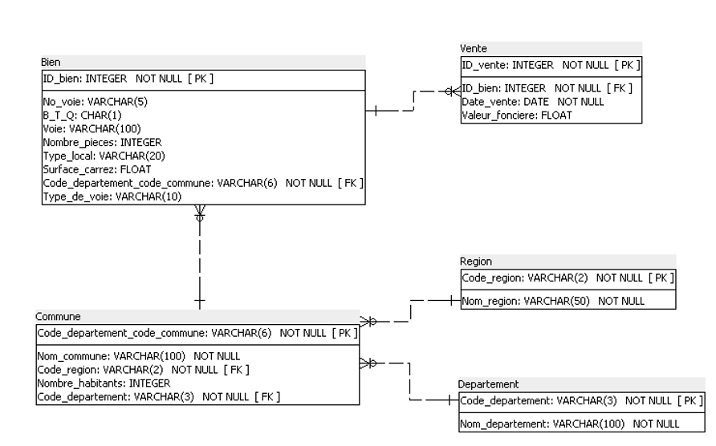
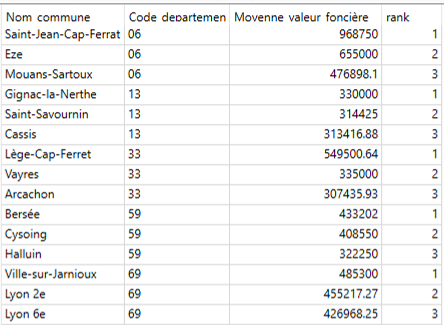

## Contexte

Ce projet a été réalisé dans le cadre de ma formation de Data Analyst chez OpenClassrooms. 

## Démarche

1. Analyse des données  

- Identification des colonnes utiles  
- Nettoyage et harmonisation  
- Construction du dictionnaire de données  

2. Conception du schéma relationnel  

- Normalisation en 3NF  
- Définition des clés primaires et étrangères  
- Gestion des cardinalités  

3. Création de la base SQLite  
 
- Création des tables  
- Import des CSV  
- Résolution des erreurs  

4. Requêtes SQL  

- Agrégations  
- Jointures multiples  
- Sous-requêtes  
- Window functions (RANK)  

## Résultats

Exemples d'analyses réalisées : 

- Nombre de ventes d'appartement par région  
- Propostion de ventes d'appartements par nombre de pièces  
- Top 10 des départements avec le prix au m² le plus élevé  
- Liste des communes comptabilisant au moins 50 ventes  
- Moyennes de valeurs foncières pour le top 3 des communes par département  

## Réalisations

{fig-align="center" fig-alt="Schéma relationnel"}

<details>
<summary><b> Top 3 des meilleures moyennes de valeurs foncières par commune (départements 6, 13, 33, 59 et 69) (SQL)</b></summary>

```sql

SELECT * 
FROM (
    SELECT *,
        RANK() OVER (
            PARTITION BY join2.Code_departement
            ORDER BY join2.Moyenne_Valeur_Foncière DESC
        ) AS rank
    FROM (
        SELECT 
            c.Nom_commune, 
            c.Code_departement,
            ROUND(AVG(join1.Valeur_fonciere), 2) AS Moyenne_valeur_foncière
        FROM (
            SELECT * 
            FROM Bien b 
            JOIN Vente v ON b.ID_bien = v.ID_bien
        ) join1
        JOIN Commune c 
            ON c.Code_departement_code_commune = join1.COde_departement_code_commune
        WHERE c.Code_departement IN ('06', '13', '33', '59', '69')
        GROUP BY c.Nom_commune
    ) join2
) 
WHERE rank <= 3;

```
</details>

{fig-align="center" fig-alt="Résultat requête"}

## Stack

`SQL`


[Voir le projet complet sur GitHub →](https://github.com/AniessD/OC_sql_BDD_immo)  
[Retour à la liste de projets →](../projects.qmd)


