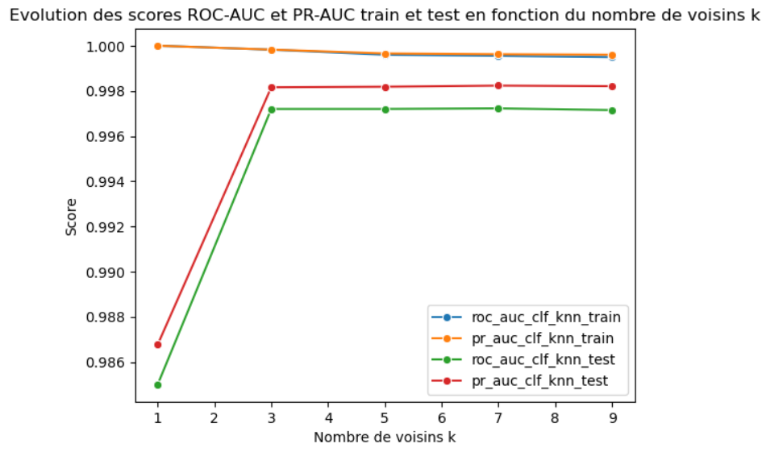

## Contexte

Ce projet a été réalisé dans le cadre de ma formation de Data Analyst chez OpenClassrooms. 

## Démarche

1. Analyse exploratoire des données
- Analyses univariées (distribution, outliers avec z-score et IQR)
- Analyses multivariées (corrélations entre variables, tests de Mann-Whitney)

D'après ces premières analyses, 3 variables semblent plus discriminantes pour la détection de faux billets : Marge en bas, Marge en haut et Longueur.

2. Pré-traitement

- Séparation du jeu de données en train/test (80/20)
- Imputation des valeurs manquantes (moyenne par type de billets car moins de 2.5% de valeurs manquantes)
- Standardisation des données

3. Test des modèles

- Régression logistique (modèle supervisé)
- KNN (modèle supervisé)
- Random forest (modèle supervisé)
- K-means (modèle non supervisé)

Pour chaque modèle, les résultats sont analysés dans un premier temps via une matrice de confusion (temporaire car seuil t non fixé à ce stade). Le meilleur modèle supervisé est ensuite choisi en comparant les scores ROC-AUC et PR-AUC. Ce modèle est optimisé en comparant ses résultats à différents seuils t. Pour finir, il est comparé au modèle non supervisé K-means en comparant leurs scores Accuracy, Precision, Rappel et F1.

4. Création de l'application
- Export du pipeline complet (prétraitement + modèle) au format .joblib
- Création du script .py avec chargement du .joblib
- 2 options d'utilisation :
    - analyse d'un seul billet en rentrant directement ses métriques
    - analyse de plusieurs billets grâce à un fichier .csv

## Résultats

Le meilleur modèle supervisé pour ce projet est la régression logistique, avec un score ROC-AUC de **99.96%** et un score PR-AUC de **99.98%** sur le jeu de test. Il reste le meilleur modèle face au modèle non supervisé (K-means) avec accuracy : **99.33%**, precision : **99.5%**, rappel : **99.5%** et score F1 : **99.5%**.

## Réalisations

<details>
<summary><b> Evaluation du modèle KNN en fonction du nombre de voisins k</b></summary>

```python
#Entraînement du modèle en faisant varier le nombre de voisins k

roc_auc_clf_knn_train_scores = []
pr_auc_clf_knn_train_scores = []
roc_auc_clf_knn_test_scores = []
pr_auc_clf_knn_test_scores = []

neighbors = range(1,11,2)

for k in neighbors :
    
    clf_knn = KNeighborsClassifier(n_neighbors=k).fit(X_train_scaled, y_train)

    #prédiction des données
    y_train_pred_proba = clf_knn.predict_proba(X_train_scaled)[:, 1]
    y_test_pred_proba = clf_knn.predict_proba(X_test_scaled)[:, 1]

    #Calcul des scores ROC-AUC et PR-AUC
    roc_auc_clf_knn_train = roc_auc_score(y_train, y_train_pred_proba)
    pr_auc_clf_knn_train = average_precision_score(y_train, y_train_pred_proba)
    roc_auc_clf_knn_test = roc_auc_score(y_test, y_test_pred_proba)
    pr_auc_clf_knn_test = average_precision_score(y_test, y_test_pred_proba)

    roc_auc_clf_knn_train_scores.append(roc_auc_clf_knn_train)
    pr_auc_clf_knn_train_scores.append(pr_auc_clf_knn_train)
    roc_auc_clf_knn_test_scores.append(roc_auc_clf_knn_test)
    pr_auc_clf_knn_test_scores.append(pr_auc_clf_knn_test)

sns.lineplot(x = neighbors, y = roc_auc_clf_knn_train_scores, marker = 'o', label = 'roc_auc_clf_knn_train')
sns.lineplot(x = neighbors, y = pr_auc_clf_knn_train_scores, marker = 'o', label = 'pr_auc_clf_knn_train')
sns.lineplot(x = neighbors, y = roc_auc_clf_knn_test_scores, marker = 'o', label = 'roc_auc_clf_knn_test')
sns.lineplot(x = neighbors, y = pr_auc_clf_knn_test_scores, marker = 'o', label = 'pr_auc_clf_knn_test')

plt.legend()
plt.title('Evolution des scores ROC-AUC et PR-AUC train et test en fonction du nombre de voisins k')
plt.xlabel('Nombre de voisins k')
plt.ylabel('Score')
plt.show()

```
</details>

{fig-align="center"}

<details>
<summary><b> Fonction de prédiction de plusieurs billets dans l'application</b></summary>

```python
def predire_plusieurs_billets(pipeline,lien_csv):
    
    with open(lien_csv, 'r', encoding='utf-8') as f:
        premiere_ligne = f.readline()
        
    separateur = ';' if ';' in premiere_ligne else ','
    
    X_raw = pd.read_csv(lien_csv, sep=separateur)

    colonnes_attendues = ["diagonal", "height_left", "height_right", "margin_low", "margin_up", "length"]

    X_filled = X_raw.dropna(subset=colonnes_attendues)

    nb_lignes_supp = X_raw.shape[0] - X_filled.shape[0]
    
    if nb_lignes_supp > 0 : 
        print(f"\nAttention : {nb_lignes_supp} billet(s) du fichier csv contienne(nt) des valeurs manquantes. Il n'est pas possible de détecter si ce(s) billet(s) sont vrai(s) ou faux. Il(s) a/ont donc été supprimé(s) du tableau de résultats.\n")

    X = X_filled[colonnes_attendues]

    y = pipeline.predict(X)

    df_resultat = X_filled.copy()
    df_resultat['Résultat_binaire'] = y
    df_resultat['Résultat'] = df_resultat['Résultat_binaire'].map({False : "Faux billet", True : 'Vrai billet'})

    return df_resultat


```
</details>

## Stack

`python` · `Jupyter` · `Machine Learning`


[Voir le projet complet sur GitHub →](https://github.com/AniessD/OC_script_detection_faux_billets)  
[Retour à la liste de projets →](../projects.qmd)


