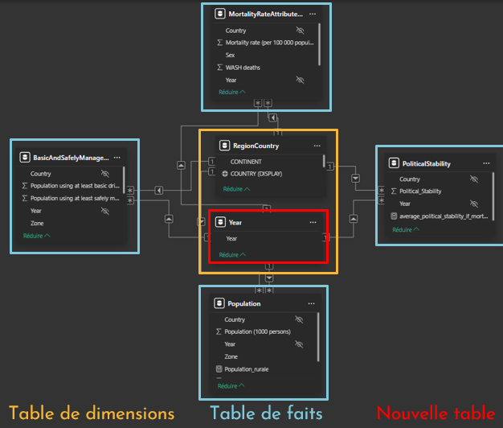

## Contexte

Ce projet a été réalisé dans le cadre de ma formation de Data Analyst chez OpenClassrooms. 

## Démarche

Le dashboard comporte 3 pages principales :

1. Mondial
- KPI mondial du nombre de décès liés à l'eau insalubre.
- Graphiques temporels agrégés pour une comparaison macro entre continents.
- Cartographie mondiale dynamique.

2. Continent
- Segmentation qualitative par Stabilité Politique ("Pays stable" / "Pays instable").
- Histogramme combiné mettant en évidence la répartition de l'accès à l'eau par pays en fonction du volume de population.
- Nuage de points croisant la stabilité politique et l'efficacité de la politique eau.

3. Pays
- Répartition du taux de mortalité par genre.
- Analyse de l'évolution temporelle (2000-2017) des services "basiques" vs "safe".
- Graphiques en courbes et barres empilées différenciant l'accès aux services d'eau en zones urbaines et rurales.

## Résultats

L'analyse a permis de conclure que : 

- **870 000 personnes** sont décédées en 2016 des suites de la consommation d'eau impropre
- **l'Afrique est** le continent ayant les pourcentages d'accès à l'eau les moins élevés au niveau mondial
- la République Unie de Tanzanie a un taux de mortalité moyen lié à l'eau en 2016 de **38.4 pour 100 000 habitants**

## Réalisations

{fig-align="center"}

<details>
<summary><b> Mesure DAX calculant le taux moyen d'accès aux services d'eau basiques</b></summary>

```dax
average_basic_drinking_services_rate_if_mortality = 
CALCULATE(
    AVERAGE(BasicAndSafelyManagedDrinkingWaterServices[Population using at least basic drinking-water services (%)]),
    BasicAndSafelyManagedDrinkingWaterServices[Zone] = "Total",
    KEEPFILTERS(MortalityRateAttributedToWater)
)


```
</details>

## Stack

`Power BI` · `DAX` · `Power Query`


[Voir le projet complet sur GitHub →](https://github.com/AniessD/OC_power_BI_etude_eau_potable/)  
[Retour à la liste de projets →](../projects.qmd)


