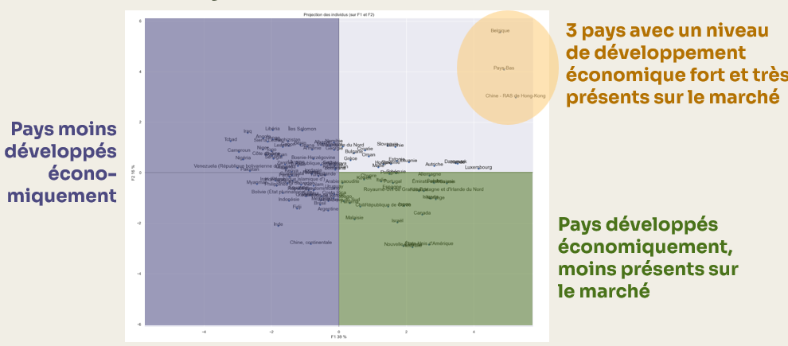

## Contexte

Ce projet a été réalisé dans le cadre de ma formation de Data Analyst chez OpenClassrooms. 

## Démarche

Critères analysés :   

- Score de stabilité politique  
- Consommation de viande de volailles (kg/personne/an)  
- Taux d'exportation  
- Taux de dépendance à l'importation    
- Nombre d'habitants  
- PIB par habitant  
- Indice de performance logistique  
- Distance avec la France (en km)  
- Score de climat des affaires  

Le dataset final après nettoyage et jointures représentent 117 pays et 86% de la population (en 2017).  

1. Préparation et nettoyage des données  

- Extraction des données  
- Nettoyage des données  
- Analyses univariées  
- Etude des corrélations entre variables  

2. Analyse en composantes principales (ACP)  

- Standardisation des données  
- Etude de l'éboulis des valeurs propores  
- Analyse du cercle des corrélations  
- Projection des individus sur les plans factoriels  
- Clustering  

3. K-means  
- Classification hiérarchique ascendante (CAH)  
- Visualisation et analyse des clusters  
- Comparaison des clusters via une matrice de contingence  

## Résultats

L'analyse a mis en évidence 2 groupes de pays à prioriser pour l'entreprise :  

- **hubs logistiques (Belgique, Hong-Kong, Pays-Bas)** : Zones de transit commercial majeures avec des taux d'exportation et d'importation très importants  
- **Marché premium à proximité** : Pays économiquement stables, proches de la France avec un taux de dépendance aux importations proche de 50%  

Une stratégie commerciale différenciée est recommandée en fonction des pays ciblés.  

## Réalisations

<details>
<summary><b> Fonction permettant d'afficher la projection des individus k</b></summary>

```python
#Fonction permettant d'afficher la projection des individus
def display_factorial_planes(   X_projected, 
                                x_y, 
                                pca=None, 
                                labels = None,
                                clusters=None, 
                                alpha=1,
                                figsize=[10,8], 
                                marker="." ):
    """
    Affiche la projection des individus

    Positional arguments : 
    -------------------------------------
    X_projected : np.array, pd.DataFrame, list of list : la matrice des points projetés
    x_y : list ou tuple : le couple x,y des plans à afficher, exemple [0,1] pour F1, F2

    Optional arguments : 
    -------------------------------------
    pca : sklearn.decomposition.PCA : un objet PCA qui a été fit, cela nous permettra d'afficher la variance de chaque composante, default = None
    labels : list ou tuple : les labels des individus à projeter, default = None
    clusters : list ou tuple : la liste des clusters auquel appartient chaque individu, default = None
    alpha : float in [0,1] : paramètre de transparence, 0=100% transparent, 1=0% transparent, default = 1
    figsize : list ou tuple : couple width, height qui définit la taille de la figure en inches, default = [10,8] 
    marker : str : le type de marker utilisé pour représenter les individus, points croix etc etc, default = "."
    """

    # Transforme X_projected en np.array
    X_ = np.array(X_projected)

    # On gère les labels
    if  labels is None : 
        labels = []
    try : 
        len(labels)
    except Exception as e : 
        raise e

    # On vérifie la variable axis 
    if not len(x_y) ==2 : 
        raise AttributeError("2 axes sont demandées")   
    if max(x_y )>= X_.shape[1] : 
        raise AttributeError("la variable axis n'est pas bonne")   

    # on définit x et y 
    x, y = x_y

    # Initialisation de la figure       
    fig, ax = plt.subplots(1, 1, figsize=figsize)

    # On vérifie s'il y a des clusters ou non
    c = None if clusters is None else clusters
 
    # Les points    
    # plt.scatter(   X_[:, x], X_[:, y], alpha=alpha, 
    #                     c=c, cmap="Set1", marker=marker)
    sns.scatterplot(data=None, x=X_[:, x], y=X_[:, y], hue=c)

    # Si la variable pca a été fournie, on peut calculer le % de variance de chaque axe 
    if pca : 
        v1 = str(round(100*pca.explained_variance_ratio_[x]))  + " %"
        v2 = str(round(100*pca.explained_variance_ratio_[y]))  + " %"
    else : 
        v1=v2= ''

    # Nom des axes, avec le pourcentage d'inertie expliqué
    ax.set_xlabel(f'F{x+1} {v1}')
    ax.set_ylabel(f'F{y+1} {v2}')

    # Valeur x max et y max
    x_max = np.abs(X_[:, x]).max() *1.1
    y_max = np.abs(X_[:, y]).max() *1.1

    # On borne x et y 
    ax.set_xlim(left=-x_max, right=x_max)
    ax.set_ylim(bottom= -y_max, top=y_max)

    # Affichage des lignes horizontales et verticales
    plt.plot([-x_max, x_max], [0, 0], color='grey', alpha=0.8)
    plt.plot([0,0], [-y_max, y_max], color='grey', alpha=0.8)

    # Affichage des labels des points
    if len(labels) : 
        for i,(_x,_y) in enumerate(X_[:,[x,y]]):
            plt.text(_x, _y+0.05, labels[i], fontsize='14', ha='center',va='center') 

    # Titre et display
    plt.title(f"Projection des individus (sur F{x+1} et F{y+1})")
    plt.show()

```
</details>

{fig-align="center" fig-alt="Projection des individus sur le plan F1 F2"}


## Stack

`python` · `Jupyter` · `Machine Learning`


[Voir le projet complet sur GitHub →](https://github.com/AniessD/OC_notebook_etude_marche)  
[Retour à la liste de projets →](../projects.qmd)


