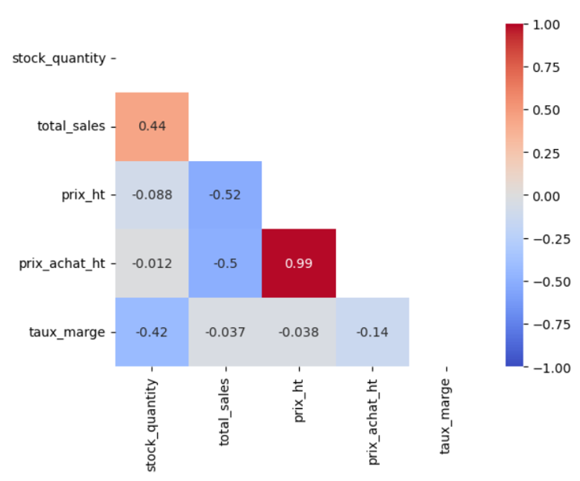

## Contexte

Ce projet a été réalisé dans le cadre de ma formation de Data Analyst chez OpenClassrooms. 

## Démarche

1. Nettoyage des données  

- correction incohérences (stock /t stock_status)  
- suppression valeurs aberrantes (prix négatifs, prix d'achats > prix de vente, doublons, ventes négatives, lignes vides)  
- gestion identifiants non conformes  
- harmonisation types et formats  

2. Consolidation  

- Jointure ERP - Liaison - Web  
- Vérification des correspondances entre identifiants  

3. Analyses  
 
- CA total et par produit  
- top produits et analyse 80/20  
- détection des outliers  
- analyse du stock  
- analyse des marges  
 - matrice de corrélation  

## Résultats

L'analyse a permis de conclure que :   

- **52%** des produits génèrent 80% du CA  
- valeur du stock = **2.1 fois le CA mensuel** => risque financier  
- marge min : 55% et marge max : **130%** => élevé  

## Réalisations

<details>
<summary><b>Heatmap de corrélation entre variables</b></summary>

```python
############################
# Analyse des corrélations #
############################

#Création d'une heatmap de corrélation avec les variables stock, sales et price
df_corr = df_merge[['stock_quantity','total_sales','prix_ht','prix_achat_ht','taux_marge']]
corr = df_corr.corr(method='pearson')
print(corr)
sns.heatmap(corr,cmap='coolwarm',annot=True,vmin=-1,vmax=1)
plt.show()
#On peut également créer un mask pour n'afficher qu'une demi heatmap
ones = np.ones_like(corr) #création d'un array de 1 de la même taille que le df étudié
mask = np.triu(ones,k=0).astype(bool) #remplacement de la partie inférieure de cet array 
#par des 0 en gardant la diagonale avec 1 puis remplacement des 0 et 1 par des booléens 
#pour lecture par la heatmap
sns.heatmap(corr,cmap='coolwarm',annot=True,vmin=-1,vmax=1,mask=mask) #ajout du mask dans la 
#heatmap. Toutes les cases = True sont masquées.
plt.show()
```
</details>

{fig-align="center" fig-alt="Demi-heatmap de corrélations entre les variables"}

## Stack

`python` · `Jupyter`


[Voir le projet complet sur GitHub →](https://github.com/AniessD/OC_notebook_gestion_donnees_boutique)  
[Retour à la liste de projets →](../projects.qmd)


