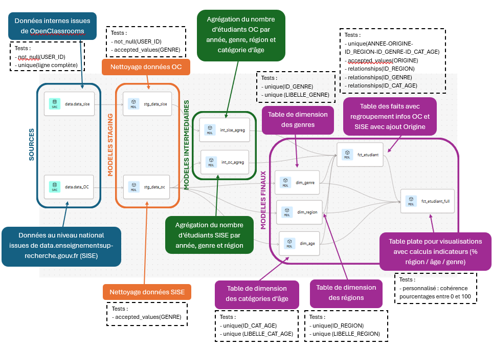

## Contexte

Ce projet a été réalisé dans le cadre de ma formation de Data Analyst chez OpenClassrooms. 

## Démarche

L'architecture du projet dans dbt est le suivant : 

1. Modèles staging (stg)
    - Nettoyage des données sources (OpenClassrooms et Nationales)
    - Normalisation des noms de colonnes

2. Modèle intermédiaires (int)

    - Agrégation des données par dimensions

3. Modèles finaux (marts)

    - Structure en étoiles avec une table des faits et des tables de dimensions
    - Union des données OpenClassrooms et Nationales
    - Table plate finale regroupant toutes les données pour visualisations avec Looker Studio

## Résultats

La comparaison des populations entre OpenClassrooms et national m'a permis de proposer 3 recommandations pour développer le panel d'étudiants chez OpenClassrooms : 

1. Recruter des étudiants hors Ile-de-France en présentant les atouts de le formation à distance

2. Tendre vers une répartition plus équilibrée entre hommes et femmes en renforçant les actions de recrutement auprès des femmes

3. Élargir le recrutement vers des étudiants en formation initiale, en complément du public en reconversion déjà majoritaire

## Réalisations

{fig-align="center"}

<details>
<summary><b> Requête pour obtenir la table plate finale (SQL)</b></summary>

```sql

{{config(materialized='table')}}

WITH agg_annee_origine_region as (
    SELECT 
        ID_REGION,
        ANNEE,
        ORIGINE,
        sum(NOMBRE_ETUDIANTS) as NOMBRE_ETUDIANTS
    FROM {{ ref('fct_etudiant') }}
    GROUP BY 1,2,3

),

pourcentage_annee_origine_region as (
    SELECT
        ID_REGION,
        ANNEE,
        ORIGINE,
        round(NOMBRE_ETUDIANTS * 100.0 / sum(NOMBRE_ETUDIANTS) OVER (PARTITION BY ANNEE,ORIGINE),2)
        as POURCENTAGE_AO_REGION
FROM agg_annee_origine_region
),

agg_annee_origine_genre as (
    SELECT 
        ID_GENRE,
        ANNEE,
        ORIGINE,
        sum(NOMBRE_ETUDIANTS) as NOMBRE_ETUDIANTS
    FROM {{ ref('fct_etudiant') }}
    GROUP BY 1,2,3

),

pourcentage_annee_origine_genre as (
    SELECT
        ID_GENRE,
        ANNEE,
        ORIGINE,
        round(NOMBRE_ETUDIANTS * 100.0 / sum(NOMBRE_ETUDIANTS) OVER (PARTITION BY ANNEE,ORIGINE),2)
        as POURCENTAGE_AO_GENRE
FROM agg_annee_origine_genre
),

agg_annee_origine_age as (
    SELECT 
        ID_CAT_AGE,
        ANNEE,
        ORIGINE,
        sum(NOMBRE_ETUDIANTS) as NOMBRE_ETUDIANTS
    FROM {{ ref('fct_etudiant') }}
    GROUP BY 1,2,3

),

pourcentage_annee_origine_age as (
    SELECT
        ID_CAT_AGE,
        ANNEE,
        ORIGINE,
        round(NOMBRE_ETUDIANTS * 100.0 / sum(NOMBRE_ETUDIANTS) OVER (PARTITION BY ANNEE,ORIGINE),2)
        as POURCENTAGE_AO_AGE
FROM agg_annee_origine_age
)

SELECT 
    f.ORIGINE,
    f.ANNEE,
    f.ID_REGION,
    r.LIBELLE_REGION,
    f.ID_GENRE,
    g.LIBELLE_GENRE,
    f.ID_CAT_AGE,
    a.LIBELLE_CAT_AGE,
    f.NOMBRE_ETUDIANTS,
    r2.POURCENTAGE_AO_REGION,
    g2.POURCENTAGE_AO_GENRE,
    a2.POURCENTAGE_AO_AGE
FROM {{ ref('fct_etudiant') }} f
    LEFT JOIN {{ ref('dim_age') }} a ON f.ID_CAT_AGE = a.ID_CAT_AGE
    LEFT JOIN {{ ref('dim_genre') }} g ON f.ID_GENRE = g.ID_GENRE
    LEFT JOIN {{ ref('dim_region') }} r ON f.ID_REGION = r.ID_REGION
    LEFT JOIN pourcentage_annee_origine_region r2 ON f.ID_REGION = r2.ID_REGION AND f.ANNEE = r2.ANNEE AND f.ORIGINE = r2.ORIGINE
    LEFT JOIN pourcentage_annee_origine_genre g2 ON f.ID_GENRE = g2.ID_GENRE AND f.ANNEE = g2.ANNEE AND f.ORIGINE = g2.ORIGINE
    LEFT JOIN pourcentage_annee_origine_age a2 ON f.ID_CAT_AGE = a2.ID_CAT_AGE AND f.ANNEE = a2.ANNEE AND f.ORIGINE = a2.ORIGINE
```
</details>

## Stack

`SQL` · `dbt`


[Voir le projet complet sur GitHub →](https://github.com/AniessD/OC_dbt_profil_socio)  
[Retour à la liste de projets →](../projects.qmd)


