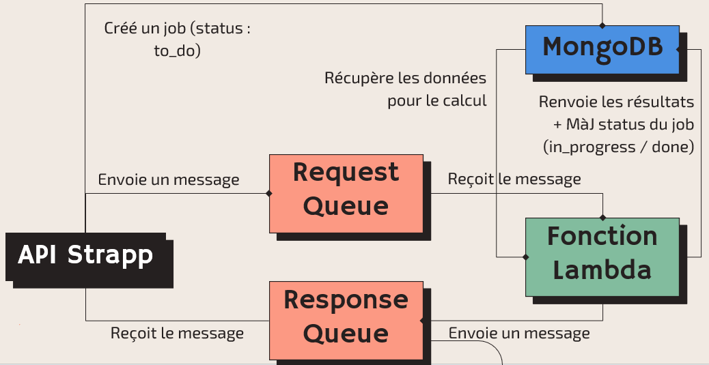
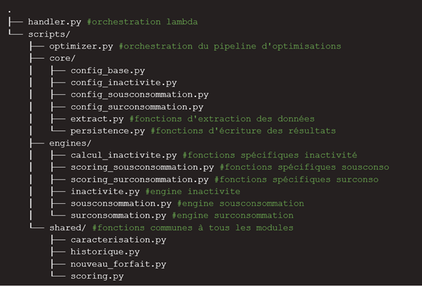

## Contexte

Ce projet a été réalisé dans le cadre d'un stage de 2 mois au sein de l'entreprise Strapp Mobile (gestion de flottes mobile pro) à Nantes. 

## Démarche

1. Analyse exploratoire des données

- 3 sujets principaux analysés : 
    - Hors-forfait
    - Surconsommation de data
    - Sous-consommation de data  
- Premières réflexions pour caractériser ces situations en fonction de critères :  
    - Occasionnel / Fréquent / Régulier
    - Nombre de mois / Fréquence moyenne / Nombre de mois consécutif

2. Méthodologie de scoring

Développement d'un algorithme de scoring par carte SIM pour identifier les profils d'usage (surconsommation / sous-consommation) et recommander automatiquement le forfait le plus adapté.

Critères retenus pour le score :   
- Nombre de mois  
- Fréquence  
- Dernier mois  
- Jour de dépassement (surconsommation)  
- Proportion de dépassement (surconsommation)  
- Proportion sous-consommation (sous-consommation)  

3. Prototype

Expérimentation :  
- Jupyter comme laboratoire pour validation de la méthode de scoring  
- Création de la méthode de proposition de forfait puis vérification de sa cohérence  

Flexibilité :   
- Tous les éléments de calcul sont paramétrables pour pouvoir adapter l'algo à toutes les situations  

## Résultats

Le projet s'est concrétisé par la livraison d'un module automatisé d'analyse et d'optimisation des forfaits. Voici son intégration au sein de l'infrastructure globale de Strapp Mobile :

{fig-align="center" fig-alt="Architecture"}

## Réalisations

{fig-align="center" fig-alt="Fonction lambda"}

<details>
<summary><b> Fonction de calcul du jour de dépassement en cas de surconsommation de data</b></summary>

```python
def calcul_jour_depassement(df_cdr, df_cartessim, dernier_forfait):
    cdr_data = df_cdr.loc[df_cdr['type'] == 'data',['date', 'dataKo', 'iccid']]
    del df_cdr

    # Lien avec id cartes sim (inner join pour exclure les iccid inconnus)
    sim_iccid = df_cartessim[['_id', 'iccid_text']]
    cdr_data = pd.merge(cdr_data, sim_iccid, left_on='iccid', right_on='iccid_text', how='inner')
    cdr_data = cdr_data[['date', 'dataKo', '_id']]

    # Calcul somme cumulée de data consommée par mois
    cdr_data = cdr_data.sort_values(['_id', 'date'])
    cdr_data['Mois concerné'] = cdr_data['date'].dt.to_period('M').dt.to_timestamp()
    cdr_data['data_cumsum_ko'] = cdr_data.groupby(['_id', 'Mois concerné'])['dataKo'].cumsum()
    cdr_data.drop(columns='dataKo', inplace=True)
    cdr_data['data_cumsum_go'] = round(cdr_data['data_cumsum_ko'] / config_base.KO_PAR_GO, 2)
    cdr_data.drop(columns='data_cumsum_ko', inplace=True)

    # Lien avec forfait utilisé (pour la surconsommation, on étudie la conso sur la période entière par rapport au dernier forfait, même si le forfait a changé entre temps)
    cdr_data = pd.merge(cdr_data, dernier_forfait[['SIM', 'data_go_number']], left_on='_id', right_on='SIM', how='inner')
    cdr_data = cdr_data[['SIM', 'date', 'data_cumsum_go', 'data_go_number']]

    # Flag puis filtre sur lignes où la somme cumulée de la conso dépasse le forfait
    mask = cdr_data['data_cumsum_go'] >= cdr_data['data_go_number'] * config_surconsommation.seuil_surconso
    cdr_data = cdr_data.loc[mask, ['SIM', 'date']]

    # Isolement du jour
    cdr_data['jour_depassement'] = cdr_data['date'].dt.day

    # Création df jour dépassement par carte sim (avec quantile configuré)
    jour_depassement = cdr_data.groupby("SIM")['jour_depassement'].quantile(config_surconsommation.percentile_jour_depassement).reset_index(name="jour_depassement")

    return jour_depassement


```
</details>

## Stack

`python` · `Jupyter` · `AWS`


[Retour à la liste de projets →](../projects.qmd)


