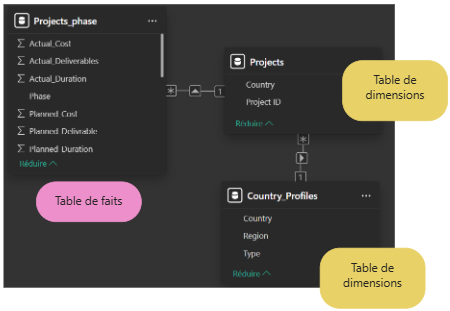

## Contexte

Ce projet a été réalisé dans le cadre de ma formation de Data Analyst chez OpenClassrooms. 

## Démarche

Le dashboard comporte 6 pages :  

1. Performance globale  

- Ecart global  
- Histogrammes prévu vs réel  

2. Projets en alerte  

- Liste des projets dépassant 15%  
- Détails par indicateur  

3. Carte du monde  

- Retard moyen par pays  

4. Planning projet  

- Sélection d'un projet dans une liste  
- Visualisation des phases prévues vs réelles  

5. Visualisations supplémentaires  

- Q&A (questions en langage naturel)  

6. Informations par projet  

- Tableau détaillé par projet  
- Filtrage dynamique en lien avec la page Projets en alerte  

## Résultats

L'analyse a permis de conclure que : 

- l'entreprise a un écart de performance global d'environ **2.5%**
- l'écart de performance est principalement porté par les coûts : **62M€** réel contre **56M€** prévu
- l'**Egypte** et le **Liban** sont les pays qui cumulent le plus de retard 

## Réalisations

{fig-align="center" fig-alt="Schéma en flocons"}

<details>
<summary><b> Mesure DAX calculant le nombre distinct de projets en alerte</b></summary>

```dax
Nb_projets_en_alerte =
CALCULATE(
    DISTINCTCOUNT(Projects[Project ID]),
    Projects[Projets_en_alerte] = "Oui"
)


```
</details>

## Stack

`Power BI` · `DAX` · `Power Query`


[Voir le projet complet sur GitHub →](https://github.com/AniessD/OC_power_BI_suivi_avancement_projet)  
[Retour à la liste de projets →](../projects.qmd)


