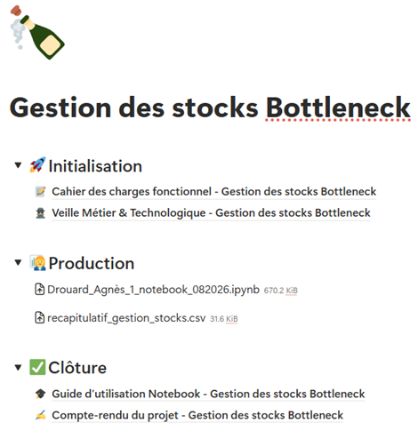

## Contexte

Ce projet a été réalisé dans le cadre de ma formation de Data Analyst chez OpenClassrooms.
Il est utilisé comme exemple de réalisation d'une veille métier et technologique, dont la méthode peut être étendue 
à d'autres besoins.

## Démarche

L'objectif est de réaliser une veille métier et technologique précise afin d'améliorer un projet existant : 
[Optimisation de la gestion des données d'une boutique.](projet-gestion-boutique.qmd)  
Dans ce projet, il a été mis en évidence une problématique de gestion des stocks. Cette veille doit donc répondre à 
ce besoin précis : **Centraliser, analyser et évaluer des méthodes de gestion des stocks**

La démarche est la suivante : 

### 1. Veille

- La veille brute est réalisée sur **Feedly** grâce aux suivis de différentes sources en lien avec la gestion des stocks
- Dès qu’un article ou autre élément est considéré comme pertinent, il est envoyé vers la base de données *Méthodes de gestion des stocks* en 1 clic via l’extension `Notion Web Clipper`
- L’article arrive automatiquement dans la liste avec le statut `A résumer`

### 2. Statut de suivi

- `A résumer` : Article capturé, en attente de lecture approfondie et prise de notes
- `Synthétisé` : Méthode analysée, les différents éléments d’évaluation sont complétés
- `Non retenu` : Méthode analysée mais non retenue pour le projet (explications dans **Limites**)

### 3. Traitement

Chaque entrée doit être résumée avec les éléments suivants pour pouvoir évaluer son utilité : 

- **Type** : S’agit-il d’une méthode `Métier` (ex : Wilson) ou d’une méthode `Technologique` (ex : script Python)
- **Description** : Résumé court de l’article expliquant la méthode
- **Difficulté de mise en place** : `Faible` / `Moyenne` / `Difficile`, à évaluer en fonction du projet
- **Fiabilité** : `Faible` / `Moyenne` / `Forte`, à évaluer en fonction du projet
- **Limites** : Description courte des limites de la méthode au regard du projet

## Résultats

La veille est concrétisée par la livraison d'une base de données Notion comprenant la liste des sources étudiées lors de la veille, 
ainsi que leurs utilisations potentielles dans le projet.
Ce travail s'inscrit dans le cadre d'un projet global de formalisation incluant un cahier des charges fonctionnel, un guide d'utilisation et un compte rendu final.

{fig-align="center" fig-alt="Sommaire du projet complet sur Notion"}

## Réalisations

---
title: "Veille métier et technologique : Méthodes de gestion des stocks"
---

<iframe 
    src="https://cooperative-editorial-60d.notion.site/ebd//3b1fa881b0e6801f9224f7a1aa46023d?v=3b1fa881b0e6801a9b5b000c354c9a0e" 
    title="Veille métier et technologique : Méthodes de gestion des stocks"
    width="100%" 
    height="600" 
    style="border: 1px solid var(--border-color); border-radius: 8px;">
</iframe>

## Stack

`Notion` · `Feedly`

[Retour à la liste de projets →](../projects.qmd)