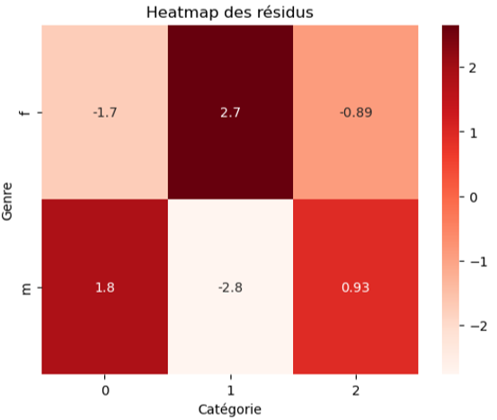

## Contexte

Ce projet a été réalisé dans le cadre de ma formation de Data Analyst chez OpenClassrooms. 

## Démarche

1. Profil des clients  

- Identification d'un groupe VIP   
- Répartition par genre (52% femmes / 48% hommes)  
- Répartition par âge (sur-représentation des 18 ans => âge mini d'inscription)  

2. Evolution dans le temps   

- CA mensuel stable, sans saisonnalité marquée  
- Nombre de transactions stabilisé  
- Arrêt total de recrutement de nouveaux clients à partir de février 2022  

3. Produits  

- 24 produits invendus => potentielle suppression  
- Analyse par catégories (0 = entrée de gamme, 1 = milieu de gamme, 2 = premium)  

4. Comportement clients  

- Genre - Catégorie : lien significatif (Chi-2)  
- Age - Dépenses : corrélation faible (Spearman)  
- Age - Fréquence d'achat : corrélation faible (Spearman)  
- Age - Panier moyen : corrélation modérée (Spearman)  
- Age - Catégorie : lien significatif (Kruskal-Wallis)  

## Résultats

L'analyse a permis de proposer les recommandations suivantes :   

- Cibler les femmes de 35-55 ans avec les produits de catégorie 1  
- Développer une offre pour les 20-30 ans avec les produits premium  
- Revoir le cataglogue (produits invendus ou très peu vendus)  
- Relancer acquisition client  

## Réalisations

<details>
<summary><b>Test du Chi-2 entre genre et catégories de produits</b></summary>

```python
# Calculer le test du Chi-2
chi2_stat, p_value, dof, expected = chi2_contingency(contingency_table)

#Hypothèse H0 : les variables sont indépendantes
#Hypothèse H1 : Les variables sont dépendantes
#Seuil choisi 
seuil = 0.05

print(f"Statistique Chi-2: {round(chi2_stat,2)}")
print(f"Valeur p: {p_value}")
if p_value < seuil :
    print("La p-value est inférieure au seuil choisi, l'hypothèse H0 est rejetée et le lien entre genre et catégorie n'est probablement pas lié au hasard.")
else : 
    print("La p-value est supérieure au seuil choisi, l'hypothèse H0 n'est pas rejettée et le lien entre genre et catégorie pourrait être dû au hasard.")

```
</details>

::: {.callout-tip title="Sortie d'exécution"}
Statistique Chi-2: **22.67**   
Valeur p: **1.1955928116587024e-05**  
La p-value est **inférieure** au seuil choisi, l'hypothèse H0 est rejetée et le lien entre genre et catégorie n'est probablement **pas lié au hasard**.

:::

{fig-align="center" fig-alt="Heatmap des résidus - Genre et catégories de produits"}

## Stack

`python` · `Jupyter`


[Voir le projet complet sur GitHub →](https://github.com/AniessD/OC_notebook_vente_librairie)  
[Retour à la liste de projets →](../projects.qmd)


